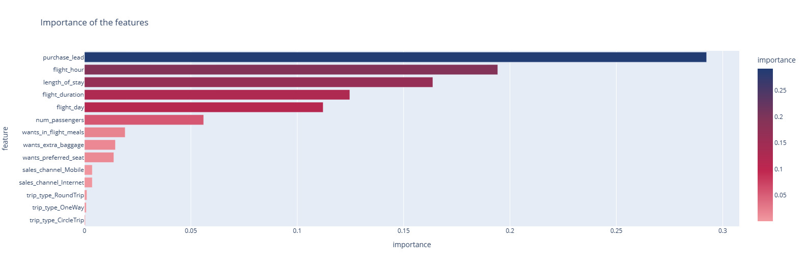
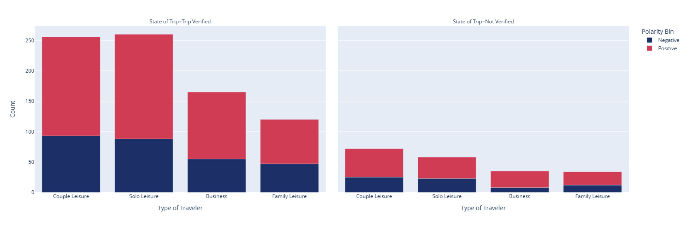
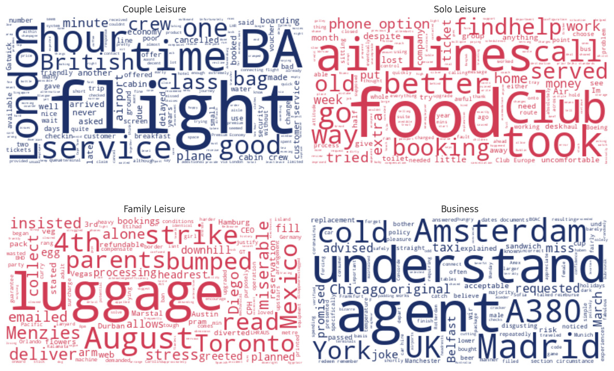
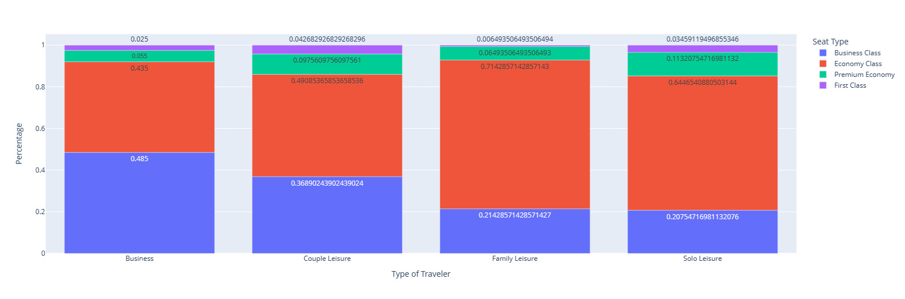

# British Airways Data Science Virtual Experience

This repository contains my work for the [British Airways Data Science Virtual Experience](https://www.theforage.com/virtual-internships/prototype/NjynCWzGSaWXQCxSX/Data%20Science) on Forage.

In this virtual experience, I completed tasks that replicate the work of the British Airways Data Science team. I learned how to scrape customer review data from the web and build predictive models.
Upon completion, I gained practical skills and experience from British Airways and deepened my understanding of data science in the context of the airline industry.

I invite you to explore my work in this repository and learn more about the virtual experience on [Forage](https://www.theforage.com/virtual-internships/prototype/NjynCWzGSaWXQCxSX/Data%20Science).

